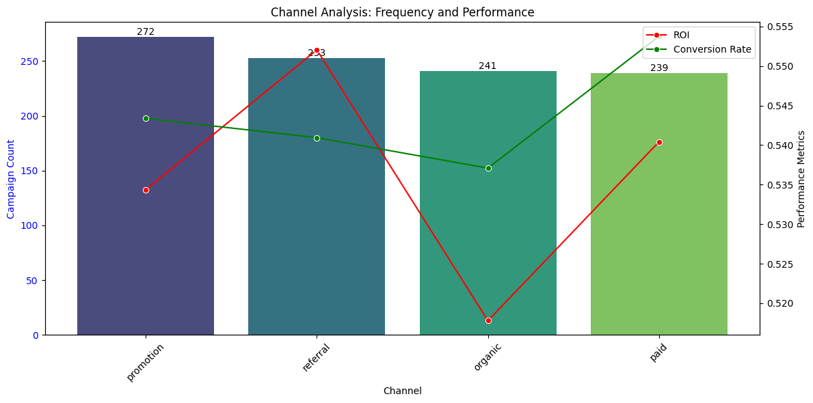
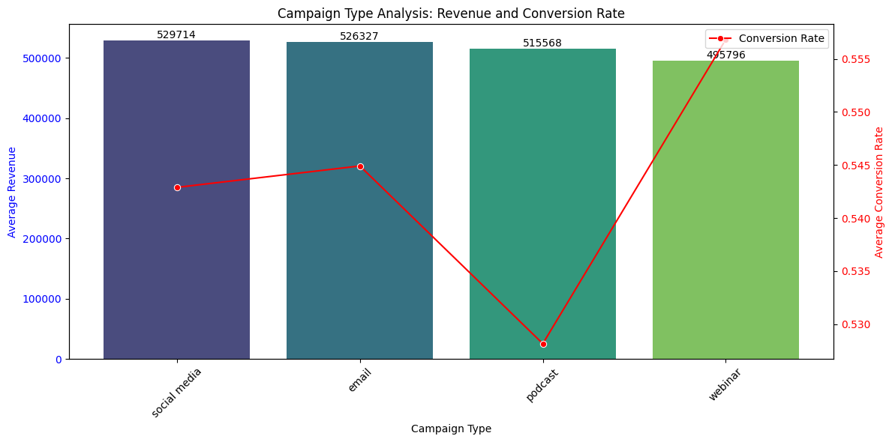
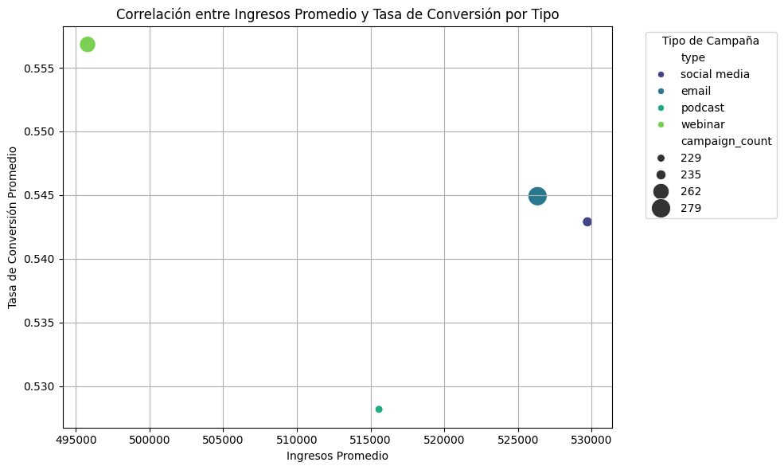
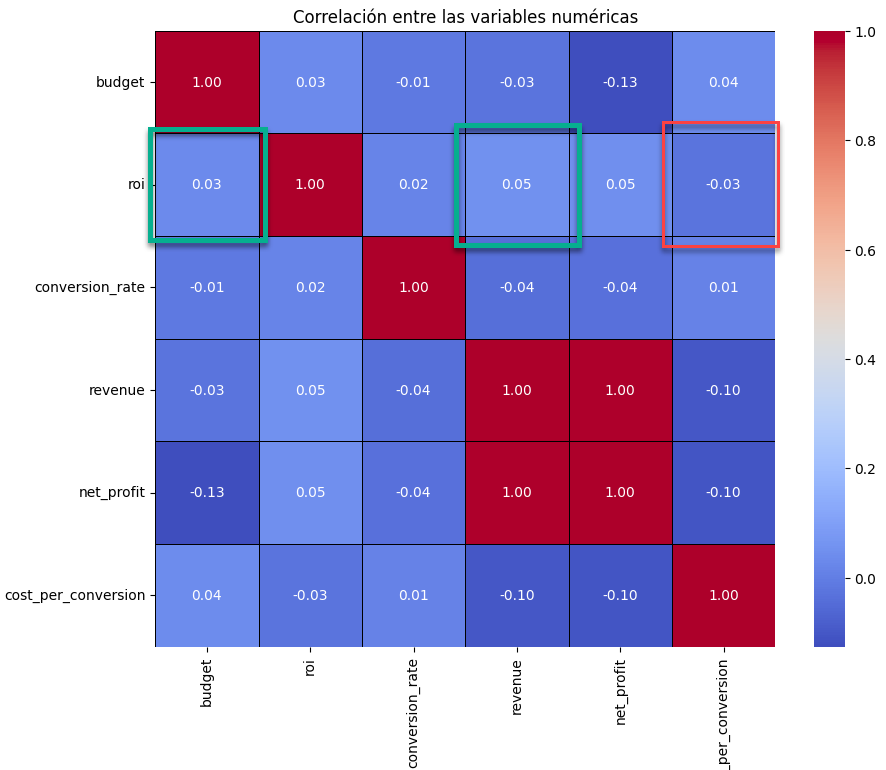
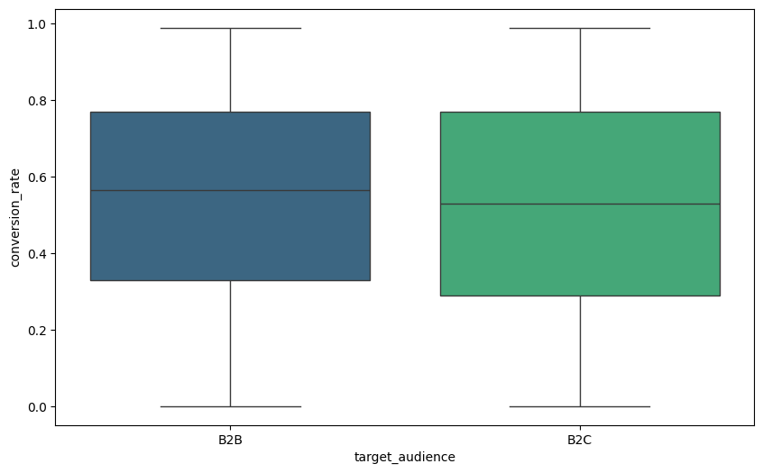
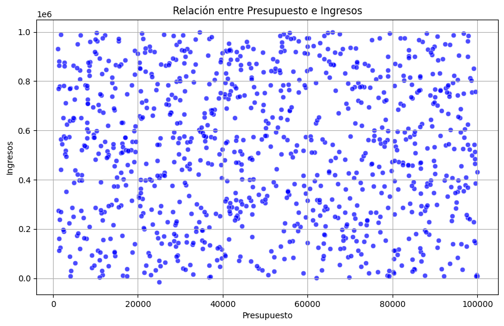
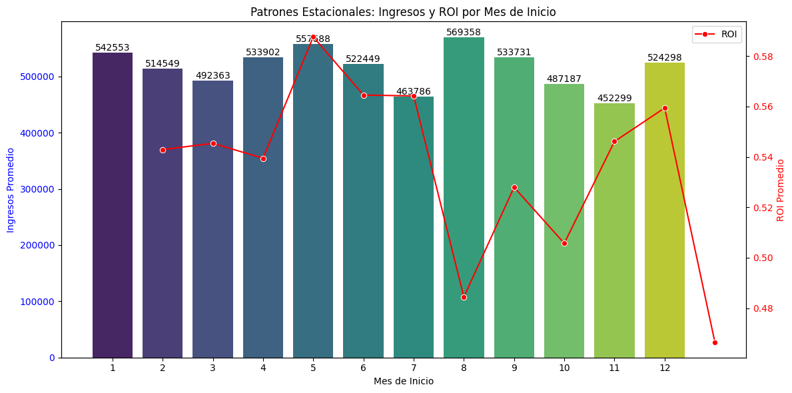

# Informe
Con resumen del trabajo que se ha hecho, he elaborado este informe en dónde presentaré, entre otras cosas:
- El trabajo de tratamiento y limpieza de datos realizado
- La realización del Análisis exploratorio
- Las respuestas a las 7 preguntas realizadas
- Gráficos que soporten las respuestas a las preguntas y recomendaciones

## 1. Descripción del trabajo realizado

Importamos las librerias necesarias y el dataset
- Revisamos la descripción, los nulos, los repetidos
- Eliminamos los duplicados, con un total de 27 registros, y para los datos raros hice varias cosas:
  - En algunos registros se habían invertido los datos de channel y type, y como eran pocos lo hice a mano
  - En otros casos, por el ejemplo el channel "referal" estaba mal escrito con una "r"  y he modificado el registro para que tenga dos "r"
  - Había algunas fechas de Febrero 30 que no existe, y la cambie a Febrero 29 ya que fue año bisiesto ese año 2024
- Para los nulos hice varias cosas:
  - Para practicar intenté rellenar los nulos del budget con el promedio del budget para otros registros para el mismo type y channel
  - El resto de nulos los eliminé, eran unos 15 registros ya que representaban menos del 1% de los datos 
- Hice el casting necesario para fechas, y floats
- Traté los outliers, sobre todo de budget, conversion rate, ROI, y fechas superpuestas y futuras, apenas 3 o 4 registros
- Calculé métricas derivadas como el beneficio neto, el cost per conversion, la clasificacion de campañas en categorias de rendimiento, entre otros, campos estacionales derivados de las fechas como mes, dia, año y cuatrimestre, entre otros.

## 2. Respuestas a las 7 Preguntas

### ¿Qué canal de marketing se utiliza con mayor frecuencia y cuál genera mejor ROI?
- **Respuesta:** Podemos ver que el canal que se utiliza con más frecuencia es "promotion" y el que tiene el mejor ROI es "Referral", que es a su vez el segundo más utilizado
- **Gráfico 1:**  
    __

### ¿Qué tipo de campaña genera más ingresos en promedio y cuál tiene mejor conversión?
- **Respuesta:** Podemos ver que las campañas de social media generan los mayores ingresos promedio y los webinars tienen la tasa de conversion mas alta
- **Gráfico 2:**  
    __

### ¿Cómo se distribuye el ROI entre las campañas? ¿Qué factores están asociados con un ROI alto?
- **Respuesta:** Con respecto a los ingresos promedios y el ROI, podemos ver, que salvo para el canal webinar, para el resto vemos que hay una correlación directa entre ingresos promedio y tasa de conversión
- **Gráfico 3:**  
    __

Sin embargo, cuando intento de buscar otra correlación, no se muy claramente, salvo que para revenue y ROI hay una relación leve positiva, y para el cost per conversion, una relación leve negativa, como se puede observar en el siguiente mapa de calor:
   __

### ¿Hay diferencias significativas en la tasa de conversión entre audiencias B2B y B2C?
- **Respuesta:** No se obsevan diferencias significativas, B2C una tasa de conversion promedio un poco menor, pero no se ven grandes diferencias
- __

### ¿Qué campaña tiene el mayor beneficio neto (net_profit)? ¿Qué características la hacen exitosa?
- **Respuesta:** La campaña "Advanced systematic complexity". Lo que hace la campaña exitosa es un ROI alto, cost per conversion bajo y budget bajo.
- _[Opcional: Agregar gráfico si es necesario]_

### ¿Existe correlación entre el presupuesto (budget) y los ingresos (revenue)?
- **Respuesta:** Pareciera que no
- __

### ¿Qué campañas tienen un ROI mayor a 0.5 y ingresos encima de 500,000?
- **Respuesta:**
Campañas filtradas:
                                    campaign_name   roi    revenue  \
1              De-engineered analyzing task-force  0.74  516609.10   
5          Upgradable transitional data-warehouse  0.59  558302.11   
9                    Intuitive responsive support  0.81  563280.30   
12                  Networked even-keeled toolset  0.58  680416.90   
21    Self-enabling human-resource infrastructure  0.69  974038.96   
...                                           ...   ...        ...   
993                Intuitive 4thgeneration access  0.78  702414.14   
995          Switchable solution-oriented success  0.96  601987.53   
996     Multi-channeled 5thgeneration methodology  0.90  537274.20   
998                   Operative tangible firmware  0.80  613448.30   
1000       Upgradable transitional data-warehouse  0.59  558302.11   

### ¿Existen patrones estacionales o temporales en el rendimiento de las campañas?
- **Respuesta:** Harian falta datos de mas años pero el ROI parece caer de cara al verano y volver a aumentar hacia fin de año
- __

---

